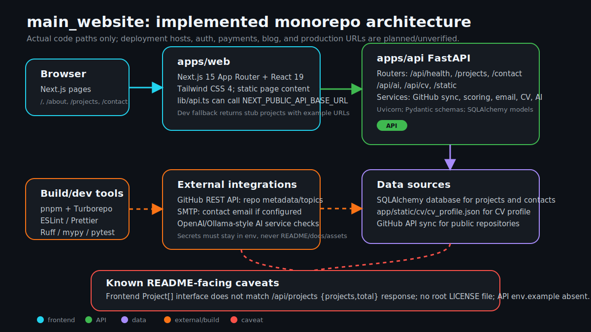
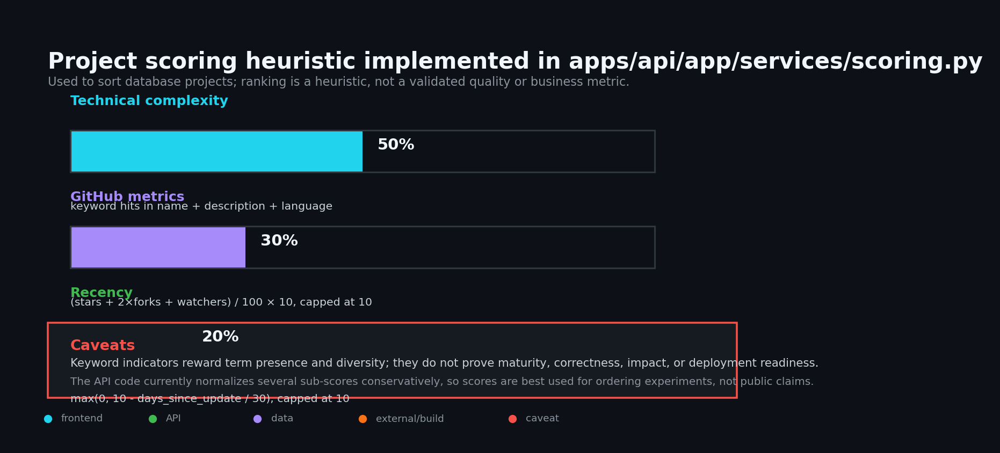

# main_website

Portfolio monorepo for Cristóbal Cortinez Duhalde, split into a Next.js frontend and a FastAPI backend. The repo is useful as a full-stack portfolio scaffold, but several surfaces are still experimental or planned, so this README distinguishes implemented code from aspirational features.



## Current status at a glance

| Area | Implemented today | Caveat |
|---|---|---|
| Web app | Next.js 15 App Router with Home, About, Projects, Contact pages | Some content is static in page files. |
| API app | FastAPI app with health, projects, showcase, contact, AI, and CV routers | Several routes depend on database, SMTP, OpenAI/Ollama, or local static data. |
| Monorepo tooling | pnpm workspaces + Turborepo | `pnpm format` writes changes; use package-level `--check` commands for CI-style verification. |
| Project data | SQLAlchemy project/contact models, GitHub sync service, hardcoded showcase service | Frontend `Project` interface does not match the `/api/projects` response shape yet. |
| CV data | `apps/api/app/static/cv/cv_profile.json` served through CV service endpoints | LinkedIn sync/export features are scaffolded, not a verified production integration. |
| Deployment | Dockerfiles and deployment-oriented docs exist | No production host/URL is verified in this README. |
| License | API package metadata says MIT | No root `LICENSE` file is tracked; do not advertise root MIT licensing until added. |

## Architecture

The intended runtime split is simple:

1. Browser requests the Next.js app in `apps/web`.
2. The frontend can call `NEXT_PUBLIC_API_BASE_URL`, defaulting to `http://localhost:8000`.
3. FastAPI in `apps/api` exposes `/api/*` routes.
4. API services read/write database models, serve static CV data, sync public GitHub repositories, and call external services only when configured.

## Project scoring heuristic

The backend includes an ordering heuristic in `apps/api/app/services/scoring.py`.



Implemented formula:

```text
score = 0.5 × technical_complexity + 0.3 × github_metrics + 0.2 × recency
```

Important caveats:

- This is a heuristic for sorting project records, not a validated ranking of quality, business value, correctness, or deployment maturity.
- Technical complexity is based on keyword hits in project name, description, and language. Keyword presence can overstate or understate real complexity.
- GitHub metrics use stars, forks, and a watcher attribute when present; low public engagement does not mean low quality.
- Recency favors recently updated repositories and can penalize stable or archived work.
- The frontend currently has a schema mismatch: `apps/web/src/lib/api.ts` expects a `Project[]` with `title`, `summary`, `tags`, and `links`, while FastAPI returns a `ProjectList` object with `projects` and `total` containing `name`, `description`, `language`, `url`, `stars`, `forks`, `topics`, and `updated_at`.

## Implemented surfaces

### Web (`apps/web`)

- Next.js 15.4.x App Router.
- React 19 and TypeScript.
- Tailwind CSS 4 via PostCSS.
- Pages:
  - `/`
  - `/about`
  - `/projects`
  - `/contact`
- `src/lib/api.ts` client helper for projects and contact submission.
- Development fallback stub projects when API calls fail in dev mode.

### API (`apps/api`)

FastAPI app mounted in `apps/api/app/main.py`:

| Router | Prefix | Implemented routes include |
|---|---|---|
| `health` | `/api` | `/health`, `/health/db` |
| `projects` | `/api` | `/projects`, `/projects/featured`, `/projects/sync`, `/projects/{id}`, `/projects/{id}/score`, `/projects/showcase*` |
| `contact` | `/api` | `POST /contact`, contact lookup/read admin-style helpers |
| `ai` | `/api` | `/ai/status`, `POST /chat`, `POST /predict`, `POST /visualize` |
| `cv` | `/api` | `/cv/profile`, `/cv/export*`, `/cv/status`, `/cv/formats`, `/cv/linkedin/status`, `/cv/download` |
| static files | `/static` | Serves `apps/api/app/static` |

### Data sources

- `apps/api/app/static/cv/cv_profile.json` for CV profile content.
- SQLAlchemy models in `apps/api/app/models/database.py` for projects and contacts.
- Public GitHub REST API for repository metadata and topics in `GitHubService`.
- Hardcoded showcase entries in `ShowcaseService`; treat demo URLs and metrics there as curated placeholders unless independently verified.
- SMTP environment variables for contact email delivery if configured.
- OpenAI/Ollama-style AI service settings if configured.

## Planned or not production-verified

- Blog, authentication, payments, monetization, premium content, and CMS workflows.
- Production deployment URLs for web and API.
- Verified live demo links from hardcoded showcase entries.
- End-to-end project API rendering in the web app without schema adaptation.
- Root MIT license claim; add a `LICENSE` file before making that claim.
- `apps/api/.env.example`; only `apps/web/env.example` is present in this clone.

## Repository map

```text
apps/
├── web/                         # Next.js frontend
│   ├── env.example              # Frontend env example (not .env.example)
│   └── src/app/                 # App Router pages and layout
└── api/                         # FastAPI backend
    ├── app/main.py              # FastAPI app, CORS, routers, static mount
    ├── app/routers/             # health, projects, contact, ai, cv
    ├── app/services/            # GitHub, scoring, contact/email, AI, CV services
    ├── app/models/              # SQLAlchemy database models
    ├── app/static/cv/           # Static CV JSON
    └── tests/                   # Pytest tests
packages/
├── config/                      # Shared config package
└── ui/                          # Minimal shared UI package placeholder
```

## Local setup

Prerequisites:

- Node.js compatible with the lockfile and `packageManager` (`pnpm@10.14.0`).
- Python 3.12+ for `apps/api`.
- PostgreSQL if you want database-backed project/contact routes instead of import/build smoke checks.

Install frontend/monorepo dependencies:

```bash
pnpm install
```

Create frontend environment file:

```bash
cp apps/web/env.example apps/web/.env.local
```

For API local development, create `apps/api/.env` manually if needed. Do not commit secrets. Common variables read by `apps/api/app/core/config.py` include:

```text
DATABASE_URL=
SECRET_KEY=
OPENAI_API_KEY=
OPENAI_MODEL=
SMTP_HOST=
SMTP_PORT=
SMTP_USER=
SMTP_PASSWORD=
SMTP_TLS=
```

Install API dependencies in a virtual environment of your choice:

```bash
cd apps/api
python -m pip install -e '.[dev]'
```

## Development commands

From the repo root:

```bash
pnpm dev          # Turborepo dev across workspaces
pnpm build        # Build workspaces
pnpm lint         # Lint workspaces
pnpm typecheck    # Type-check workspaces
pnpm test         # Run workspace tests; web currently echoes "No tests yet"
```

Individual apps:

```bash
pnpm --filter web dev        # Next.js dev server
pnpm --filter web build      # Next.js production build
pnpm --filter web lint       # ESLint
pnpm --filter web typecheck  # TypeScript compiler

pnpm --filter api dev        # Uvicorn via apps/api/package.json
pnpm --filter api test       # Pytest via apps/api/package.json
pnpm --filter api lint       # Ruff via apps/api/package.json
```

Direct API checks from `apps/api`:

```bash
pytest
ruff check .
ruff format --check .
mypy .
python -m compileall -q app tests scripts
```

## Deployment notes

- Frontend: `apps/web` can be deployed as a Next.js app after `pnpm --filter web build` passes.
- API: `apps/api` can run with Uvicorn and has a Dockerfile, but production deployment requires real environment variables, CORS review, database provisioning, and secret management.
- Do not publish fake production URLs in docs. Add links only after a smoke check against the deployed target.

## Security and privacy

- Never place API keys, SMTP passwords, database credentials, or personal contact data in README examples.
- Treat frontend `NEXT_PUBLIC_*` values as browser-visible.
- Treat static CV JSON and hardcoded page content as public if deployed.
- The implemented `/contact` page still contains `yourusername` GitHub/LinkedIn links and `your.email@example.com`; replace them with reviewed destinations or remove them before public launch.
- Review `ShowcaseService` and dev fallback project links before public launch; placeholders should not be marketed as live production demos.

## License

No root `LICENSE` file is present in this clone. The API package metadata declares MIT, but the repository README should not claim root MIT licensing until a license file is added.
