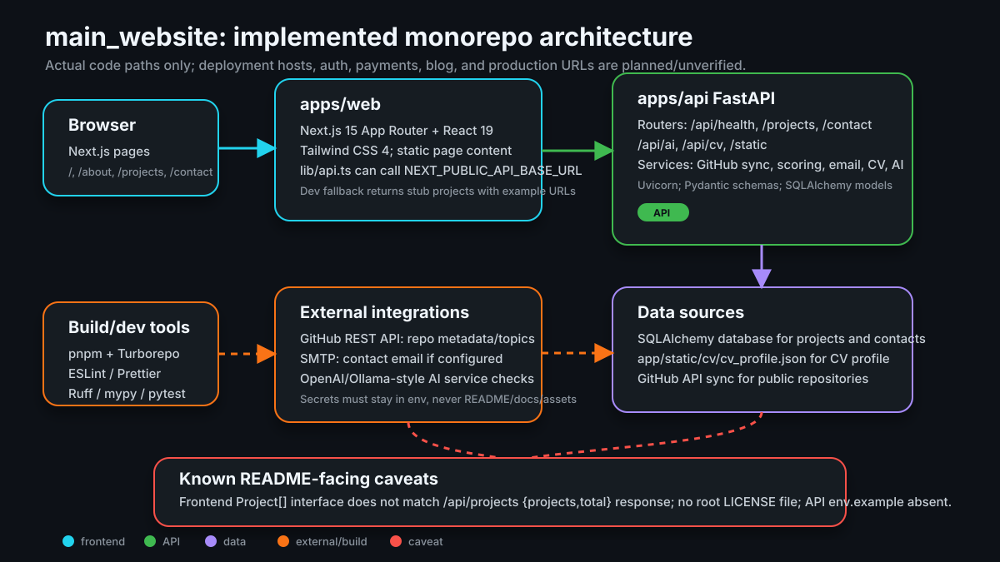
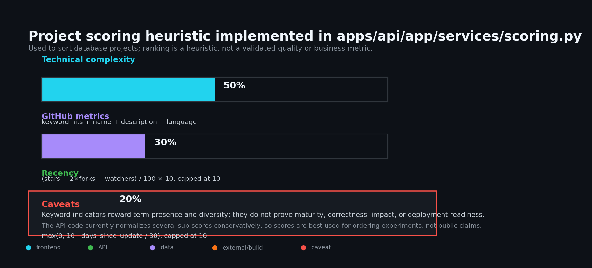

# main_website

Portfolio monorepo for Cristóbal Cortinez Duhalde, split into a Next.js frontend and a FastAPI backend. The repo is useful as a full-stack portfolio scaffold, but several surfaces are still experimental or planned, so this README distinguishes implemented code from aspirational features.



## Current status at a glance

| Area             | Implemented today                                                                  | Caveat                                                                                                                                         |
| ---------------- | ---------------------------------------------------------------------------------- | ---------------------------------------------------------------------------------------------------------------------------------------------- |
| Web app          | Next.js 16.3.4 App Router with Home, About, Projects, Contact pages                | Some content is static in page files.                                                                                                          |
| API app          | FastAPI app with health, projects, showcase, contact, AI, and CV routers           | Several routes depend on database, SMTP, OpenAI/Ollama, or local static data.                                                                  |
| Monorepo tooling | pnpm 10.34.5 workspaces + Turborepo, with managed Node 24.19.0                     | Native dependency fallback scripts are explicitly denied because locked optional binaries pass load/build verification.                        |
| Project data     | SQLAlchemy project/contact models, GitHub sync service, hardcoded showcase service | Frontend `Project` interface does not match the `/api/projects` response shape yet.                                                            |
| CV data          | `apps/api/app/static/cv/cv_profile.json` served through CV service endpoints       | Typed JSON Resume and optional PDF exports are locally verified; LinkedIn remains an optional provider, not a verified production integration. |
| Deployment       | Dockerfiles and deployment-oriented docs exist                                     | No production host/URL is verified in this README.                                                                                             |
| License          | API package metadata says MIT                                                      | No root `LICENSE` file is tracked; do not advertise root MIT licensing until added.                                                            |

## Architecture

The intended runtime split is simple:

1. Browser requests the Next.js app in `apps/web`.
2. The frontend can call `NEXT_PUBLIC_API_BASE_URL`, defaulting to `http://localhost:8000`.
3. FastAPI in `apps/api` exposes `/api/*` routes.
4. API services read/write database models, serve static CV data, sync public GitHub repositories, and call external services only when configured.

## Project scoring heuristic

The backend includes an ordering heuristic in `apps/api/app/services/scoring.py`.



Implemented formula:

```text
score = 0.5 × technical_complexity + 0.3 × github_metrics + 0.2 × recency
```

Important caveats:

- This is a heuristic for sorting project records, not a validated ranking of quality, business value, correctness, or deployment maturity.
- Technical complexity is based on keyword hits in project name, description, and language. Keyword presence can overstate or understate real complexity.
- GitHub metrics use stars, forks, and a watcher attribute when present; low public engagement does not mean low quality.
- Recency favors recently updated repositories and can penalize stable or archived work.
- The frontend currently has a schema mismatch: `apps/web/src/lib/api.ts` expects a `Project[]` with `title`, `summary`, `tags`, and `links`, while FastAPI returns a `ProjectList` object with `projects` and `total` containing `name`, `description`, `language`, `url`, `stars`, `forks`, `topics`, and `updated_at`.

## Implemented surfaces

### Web (`apps/web`)

- Next.js 16.3.4 App Router.
- React 19 and TypeScript.
- Tailwind CSS 4 via PostCSS.
- Pages:
  - `/`
  - `/about`
  - `/projects`
  - `/contact`
- `src/lib/api.ts` client helper for projects and contact submission.
- Development fallback stub projects when API calls fail in dev mode.

### API (`apps/api`)

FastAPI app mounted in `apps/api/app/main.py`:

| Router       | Prefix    | Implemented routes include                                                                                           |
| ------------ | --------- | -------------------------------------------------------------------------------------------------------------------- |
| `health`     | `/api`    | `/health`, `/health/db`                                                                                              |
| `projects`   | `/api`    | `/projects`, `/projects/featured`, `/projects/sync`, `/projects/{id}`, `/projects/{id}/score`, `/projects/showcase*` |
| `contact`    | `/api`    | `POST /contact`, contact lookup/read admin-style helpers                                                             |
| `ai`         | `/api`    | `/ai/status`, `POST /chat`, `POST /predict`, `POST /visualize`                                                       |
| `cv`         | `/api`    | `/cv/profile`, `/cv/export*`, `/cv/status`, `/cv/formats`, `/cv/linkedin/status`, `/cv/download`                     |
| static files | `/static` | Serves `apps/api/app/static`                                                                                         |

### Data sources

- `apps/api/app/static/cv/cv_profile.json` for CV profile content.
- SQLAlchemy models in `apps/api/app/models/database.py` for projects and contacts.
- Public GitHub REST API for repository metadata and topics in `GitHubService`.
- Hardcoded showcase entries in `ShowcaseService`; treat demo URLs and metrics there as curated placeholders unless independently verified.
- SMTP environment variables for contact email delivery if configured.
- OpenAI/Ollama-style AI service settings if configured.

## Planned or not production-verified

- Blog, authentication, payments, monetization, premium content, and CMS workflows.
- Production deployment URLs for web and API.
- Verified live demo links from hardcoded showcase entries.
- End-to-end project API rendering in the web app without schema adaptation.
- Root MIT license claim; add a `LICENSE` file before making that claim.
- `apps/api/.env.example`; only `apps/web/env.example` is present in this clone.

## Repository map

```text
apps/
├── web/                         # Next.js frontend
│   ├── env.example              # Frontend env example (not .env.example)
│   └── src/app/                 # App Router pages and layout
└── api/                         # FastAPI backend
    ├── app/main.py              # FastAPI app, CORS, routers, static mount
    ├── app/routers/             # health, projects, contact, ai, cv
    ├── app/services/            # GitHub, scoring, contact/email, AI, CV services
    ├── app/models/              # SQLAlchemy database models
    ├── app/static/cv/           # Static CV JSON
    └── tests/                   # Pytest tests
packages/
├── config/                      # Shared config package
└── ui/                          # Minimal shared UI package placeholder
```

## Local setup

Prerequisites:

- Corepack or pnpm bootstrap capable of honoring `packageManager` (`pnpm@10.34.5`).
- Network access on first install so pnpm can cache the managed development runtime (`node@24.19.0`); subsequent scripts use that runtime even when the host Node is newer.
- Python 3.12+ for `apps/api`.
- PostgreSQL if you want database-backed project/contact routes instead of import/build smoke checks.

Install frontend/monorepo dependencies from the lockfile:

```bash
corepack enable
pnpm install --frozen-lockfile
pnpm run check:dependency-build-policy
```

Dependency updates are discovered from the repository root, which owns the one
workspace lockfile. React runtime and declaration updates are grouped across web
and UI packages; both currently resolve React 19.2.8 with
`@types/react` 19.2.18 and `@types/react-dom` 19.2.7. Keep the declared
TypeScript 5 and Node 24 families until their recorded compatibility triggers in
`docs/ARCHITECTURE.yaml` are satisfied.

Create frontend environment file:

```bash
cp apps/web/env.example apps/web/.env.local
```

For API local development, create `apps/api/.env` manually if needed. Do not commit secrets. Common variables read by `apps/api/app/core/config.py` include:

```text
DATABASE_URL=
SECRET_KEY=
OPENAI_API_KEY=
OPENAI_MODEL=
SMTP_HOST=
SMTP_PORT=
SMTP_USER=
SMTP_PASSWORD=
SMTP_TLS=
```

Install API dependencies in a virtual environment of your choice:

```bash
cd apps/api
python -m pip install -e '.[dev,pdf]'
```

## Development commands

From the repo root:

```bash
pnpm dev          # Turborepo dev across workspaces
pnpm build        # Build artifact-producing workspaces (currently the Next.js web app)
pnpm lint         # Lint workspaces
pnpm typecheck    # Type-check workspaces
pnpm test         # Run workspace tests; web currently echoes "No tests yet"
pnpm run check:dependency-build-policy  # Verify denied versions, script hashes, and pending-build state
```

Individual apps:

```bash
pnpm --filter web dev        # Next.js dev server
pnpm --filter web build      # Next.js production build
pnpm --filter web lint       # ESLint
pnpm --filter web typecheck  # TypeScript compiler

pnpm --filter api dev        # Uvicorn via apps/api/package.json
pnpm --filter api test       # Pytest via apps/api/package.json
pnpm --filter api lint       # Ruff via apps/api/package.json
```

Direct API checks from `apps/api`:

```bash
pytest
ruff check .
ruff format --check .
mypy .
python -m compileall -q app tests scripts
```

The API's wheel includes the reviewed public CV fixture. To verify an installed
artifact independently of the checkout, run these commands from the repository
root with a fresh output directory and environment:

```bash
python -m pip wheel --no-deps --wheel-dir /tmp/portfolio-api-wheels apps/api
python -m venv /tmp/portfolio-api-wheel-env
/tmp/portfolio-api-wheel-env/bin/python -m pip install /tmp/portfolio-api-wheels/portfolio_api-*.whl
python scripts/check_installed_api.py --python /tmp/portfolio-api-wheel-env/bin/python
```

The check uses an isolated interpreter and temporary working directory to import
the application, export the typed fixture and verify that AI context omits contact
fields. It does not contact providers or exercise a deployed database. Setuptools
build output is excluded from Mypy's discovery of source files; existing type-check
coverage and legacy per-module exclusions are unchanged.

## Deployment notes

- Frontend: `apps/web` can be deployed as a Next.js app after `pnpm --filter web build` passes.
- API: `apps/api` can run with Uvicorn and has a Dockerfile, but production deployment requires real environment variables, CORS review, database provisioning, and secret management.
- Do not publish fake production URLs in docs. Add links only after a smoke check against the deployed target.

## Security and privacy

- Never place API keys, SMTP passwords, database credentials, or personal contact data in README examples.
- Treat frontend `NEXT_PUBLIC_*` values as browser-visible.
- Treat static CV JSON and hardcoded page content as public if deployed.
- The static contact page intentionally publishes the curated resume email and reviewed profile links; treat them as public deployment content and change or redact them only with privacy/content regression coverage.
- Review `ShowcaseService` and dev fallback project links before public launch; placeholders should not be marketed as live production demos.

## License

No root `LICENSE` file is present in this clone. The API package metadata declares MIT, but the repository README should not claim root MIT licensing until a license file is added.

### Optional contact administration

Public contact submission remains anonymous. Reading a saved contact and marking it
as read require `Authorization: Bearer <token>`. Configure `CONTACT_ADMIN_TOKEN`
only on the API server using a unique cryptographically random secret of at least
32 characters, stored in the deployment secret manager. Missing, empty, short or
whitespace-only configuration disables both administrative routes (503); missing
or incorrect credentials return 401 before database access.

Use HTTPS for any remote API access. Never place this token in browser code, public
Next.js environment variables, URL query strings, logs or source control. Rotate it
by replacing the server-side secret and restarting the API. This single-owner
boundary is scoped to the contact inbox; it does not provide user accounts, roles
or authorization for unrelated optional API routes. `SECRET_KEY` is not reused.

## Public résumé exports

The static [`/cv/preview`](apps/web/src/app/cv/preview/page.tsx) page reuses the current public About content. Optional download links require an explicitly configured API. JSON Resume comes from the current typed API CV fixture and preserves month/year precision and project evidence limits; PDF uses the optional ReportLab extra. No provider request runs during export or curated project fallback.

```sh
python -m pip install './apps/api[pdf]'
portfolio-cv --capabilities
portfolio-cv --format jsonresume --output ./resume.json
portfolio-cv --format pdf --output ./resume.pdf
```

The destination directory must already exist. The CLI works outside the checkout and atomically replaces an output only after rendering succeeds. Install `./apps/api` without extras for JSON-only use. See [public contracts and prototype disposition](docs/CV_EXPORTS.md) for HTTP endpoints, stable curated project ordering, optional dependency limitations and verification commands.

## Repository architecture checks

Install the declared governance dependencies with `python -m pip install -r requirements-architecture.txt pytest`, then run `python -m pytest tests/architecture` and `python scripts/check_portfolio_architecture.py`. These checks enforce complete API manifest parity and security minimums using packaging; newer selected pins still need their own compatibility review. No application runtime dependency is added by this tooling profile.
